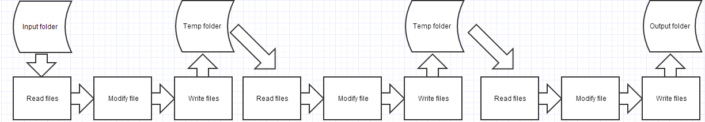
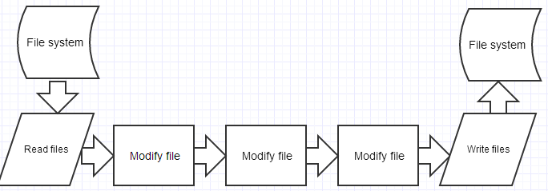

# 基于流的自动化构建工具 —— gulp

## 前言

其实好早前就用过 gulp 了，不过之前都是都是用别人配置好的，我直接执行个 `gulp` 就好了，最近才重新里里外外搞了下这个工具 orz。另外，本文并不涉及 Java 世界的 Gradle 等构建工具以及其他世界或者一些更老的构建工具。

*   [基于流的自动化构建工具 —— gulp](#%E5%9F%BA%E4%BA%8E%E6%B5%81%E7%9A%84%E8%87%AA%E5%8A%A8%E5%8C%96%E6%9E%84%E5%BB%BA%E5%B7%A5%E5%85%B7-gulp)
    *   [前言](#%E5%89%8D%E8%A8%80)
    *   [史前时代](#%E5%8F%B2%E5%89%8D%E6%97%B6%E4%BB%A3)
    *   [grunt 与 gulp](#grunt-%E4%B8%8E-gulp)
    *   [正式开始前的啰嗦](#%E6%AD%A3%E5%BC%8F%E5%BC%80%E5%A7%8B%E5%89%8D%E7%9A%84%E5%95%B0%E5%97%A6)
    *   [一起来使用 gulp 吧](#%E4%B8%80%E8%B5%B7%E6%9D%A5%E4%BD%BF%E7%94%A8-gulp-%E5%90%A7)
    *   [Reference](#reference)

## 史前时代

如果你有写过一些 Web 的小项目，在发布之前，一般会需要对 JS、CSS、图片等进行压缩后再放到服务器上 (这样网站加载就更快了)，这个时候，你就会打开 Google，搜 `压缩JS`，然后找到了许多在线压缩网站，然后将每个 JS 文件的代码复制粘贴到这些网站，在线压缩后再复制粘贴回原文件，重复处理其他文件，小项目是可以接受的，但如果项目很大呢？简直不能忍啊。这个时候，聪明的人想到了编写程序来自动完成这些任务。**gulp** 就是这样一个工具。

## grunt 与 gulp

在 gulp 被创造出来之前，有一个叫做 grunt 的自动化构建工具，这个工具对于一个文件执行一系列自动化操作时是这样的：



先读文件，然后执行一个操作，然后写文件，再读文件，执行另一个操作······每一个操作都需要执行读入和写出操作，这其实也是一种重复的操作，是可以省略的。我们来看看 gulp 是怎么干的：



gulp 先是读文件，然后一次性执行多个修改，直至最终写文件到输出目录中，中间不需要单独的写文件和读文件，数据就像水流一样，从一个地方抽上来，经一个管道一直输送到目的地，任何的操作都在管道中执行。

再来看下用 grunt 和 gulp 时所写的 js 配置文件：

Grunt

```js
sass: {
  dist: {
    options: {
      style: 'expanded'
    },
    files: {
      'dist/assets/css/main.css': 'src/styles/main.scss',
    }
  }
},
autoprefixer: {
  dist: {
    options: {
      browsers: [
        'last 2 version', 'safari 5', 'ie 8', 'ie 9', 'opera 12.1', 'ios 6', 'android 4'
      ]
    },
    src: 'dist/assets/css/main.css',
    dest: 'dist/assets/css/main.css'
  }
},
grunt.registerTask('styles', ['sass', 'autoprefixer']);
```

每一个插件都需要单独配置并写好输入和输出路径，这更像是“配置”而不是“写代码”。

Gulp

```js
var gulp = require('gulp'),
    autoprefixer = require('gulp-autoprefixer'),
    sass = require('gulp-ruby-sass');
gulp.task('sass', function() {
  return sass('src/styles/main.scss', { style: 'expanded' })
    .pipe(autoprefixer('last 2 version', 'safari 5', 'ie 8', 'ie 9', 'opera 12.1', 'ios 6', 'android 4'))
    .pipe(gulp.dest('dist/assets/css'));
});
```

这种配置写法就像写代码一样，十分苏胡，此处应有笑脸。所以最终 gulp 击败了 grunt 并迅速获得了大家的宠爱。

## 正式开始前的啰嗦

gulp 的一些优点:

1.  gulp 是基于流的自动化构建工具，所有文件都被转换为数据流 (*data stream*)，然后通过管道 (*pipe*) 传输，执行完所有操作后再转换成文件，省去了像 grunt 那样中间频繁的 I/O 操作，构建起来就会更加快速

2.  使用写代码的方式来配置操作，这对于习惯写代码的人来说无疑是件好事

3.  除了继承自 [Orchestrator](https://github.com/robrich/orchestrator) 的 API 和 gulp 内部的 API，gulp 对外开放的独有 API 只有 4 个，这样实际使用就简单多了

4.  gulp 的插件指南很严格，可以放心使用

5.  许多主流 IDE 和编程语言都支持 gulp

所以，这是一个省却重复劳动的绝佳选择！

## 一起来使用 gulp 吧

使用 gulp 需要先安装 node，你当然可以去 [官网](https://nodejs.org/zh-cn/) 下载相应版本，然后在你的电脑里安装，但是 node 更新得很快，需要换版本的时候又要去官网下，很麻烦，我推荐使用 [nvm](https://github.com/creationix/nvm) (*node package manager*)，这个 node 包管理器不仅可以在你的 shell 里远程指定安装任意 node 版本，还可以自由切换使用安装好的版本，相当方便。

在 shell 中执行：

```
curl -o- https://raw.githubusercontent.com/creationix/nvm/[版本号]/install.sh | bash
```

`[版本号]` 应替换成相应版本号，当前最新版本号为 `v0.33.0`。

然后安装最新版本的 node：

```
nvm install node
```

指定使用最新版本的 node：

```
nvm use node
```

然后安装 gulp 和可以执行各种自动化操作的小插件，这需要用到 [npm](https://www.npmjs.com/) (*node package manager*)，这是 node 默认的软件包管理系统，在安装 node 的时候就已经安装好了。在安装小插件之前，我们最好在项目的根目录下增加一个 `package.json` 文件，这个文件可以说明我们的项目需要依赖的包，规定相应的包应该使用的版本，可以更好地管理你的项目依赖的包。你可以参考 [package.json配置](https://docs.npmjs.com/files/package.json) 对 `package.json` 文件进行详细而全面的配置。此处使用简要设置。执行：

```
npm init
```

除了 `author` 需要填一下，其他采用默认即可。

接下来安装 gulp：

如果你之前全局安装过 gulp，先执行删除命令：

```
npm rm --global gulp
```

全局安装：

```
npm install --global gulp-cli
```

进入本地项目中进行本地安装：

```
npm install --save-dev gulp
```

在继续之前先解释下上面两个命令，`--global` 可用 `-g` 替代，后者是简写。全局安装可以选择 `gulp` 或 `gulp-cli` ，后者是 `gulp` 的命令行版本，我推荐后者，因为后者比前者增加了许多命令行的支持。之所以要全局安装，是因为本地安装后，gulp 可执行程序的路径并未写入到环境变量 `PATH` (可执行 `echo $PATH` 查看 `PATH`) 中，这样是无法在 shell 中使用 gulp 的。之所以要本地安装，是因为全局安装后，在 shell 中执行 gulp 时会默认查找本地安装的 gulp，没有的话则会报错，所以全局安装和本地安装都是必须的。 `--save-dev` 是把安装包的版本号加到 `package.json` 文件中的 `devDependencies`，即开发依赖（开发中需要用到）中，如果换成 `--save`，则是把安装包的版本号加到 `package.json` 文件的 `dependencies`，即产品依赖 (产品线上需要用到)中。一些常用的命令行选项的简写形式可参见 [这里](https://docs.npmjs.com/misc/config#shorthands-and-other-cli-niceties)。

接下来，我们需要本地安装一些插件包，在此为了便于示范只安装 JS 压缩插件 [gulp-uglify](https://www.npmjs.com/package/gulp-uglify)，丰富的 gulp 插件可以在 [npm search](https://www.npmjs.com/search?q=) 搜索，加上 `gulp-` 前缀即可。本地安装：

```
npm install --save-dev gulp-uglify
```

要同时安装多个插件只需将多个插件名卸载 `npm install --save-dev` 后面，用空格隔开。

接着，我们需要编写 gulp 的配置文件 `gulpfile.js`，在这之前我们需要了解下下面要用到的 gulp 的三个 API 函数，其他请参见 [gulp API docs](https://github.com/gulpjs/gulp/blob/master/docs/API.md) ：

1.  gulp.src(globs[, options])

    `globs` 是匹配模式，可以是匹配模式的支付串或匹配模式支付串的数组，用于匹配读入的文件名，`options` 为附加选项，`options` 类型为 Object，详情参见 [gulp-src](https://github.com/gulpjs/gulp/blob/master/docs/API.md#gulpsrcglobs-options) 。

2.  gulp.dest(path[, options])

    `path` 是写入文件的输出文件夹路径，`path` 类型为 String 或者 Function，`options` 为附加选项，类型为 Object，详情参见 [gulp-dest](https://github.com/gulpjs/gulp/blob/master/docs/API.md#gulpdestpath-options) 。

3.  gulp.task(name [, deps] [, fn])

    `name` 是在 shell 执行 `gulp [任务]` 时的任务名，类型为 String，`deps` 类型为 Array，是指在你的任务执行之前需要执行的一系列任务，`fn` 类型是 Function，是执行你的这个任务的主要操作的函数，详情参见 [gulp-task](https://github.com/gulpjs/gulp/blob/master/docs/API.md#gulptaskname--deps--fn)。

可以编写 `gulpfile.js` 文件并把它添加到项目根目录下，编写如下：

```js
// 引入插件模块
var gulp = require('gulp'),
    uglify = require('gulp-uglify'); 
gulp.task('script', function() {
    return gulp.src('src/js/*.js')
        .pipe(ugligy()) // pipe() 是继承自 node 的管道函数 
        .pipe(gulp.dest('dist/js'));
});
```

现在打开 shell，进入项目的目录，输入：

```
gulp script
```

刷刷刷，几行执行提示后你的自动化工作就完成了，你的项目目录下已经生成了 dist 目录，该目录下已经有压缩好的 JS 文件，棒！

去 [npm search](https://www.npmjs.com/search?q=) 探索更多的插件吧，可以帮你完成但不限于压缩、编译、合并、测试的小任务。

## Reference

*   [gulp documentation](https://github.com/gulpjs/gulp/blob/master/docs/README.md)
*   [Getting started with gulp](https://markgoodyear.com/2014/01/getting-started-with-gulp/)
*   [Building With Gulp](https://www.smashingmagazine.com/2014/06/building-with-gulp/)
*   [Inspiration (slides) about why gulp was made](http://slides.com/contra/gulp#/)
*   [npm Documentation](https://docs.npmjs.com/)
