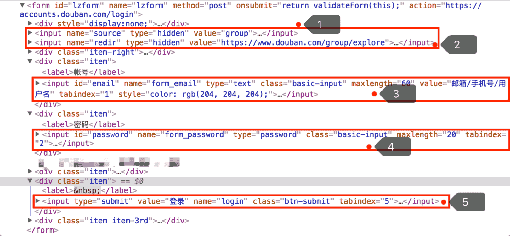
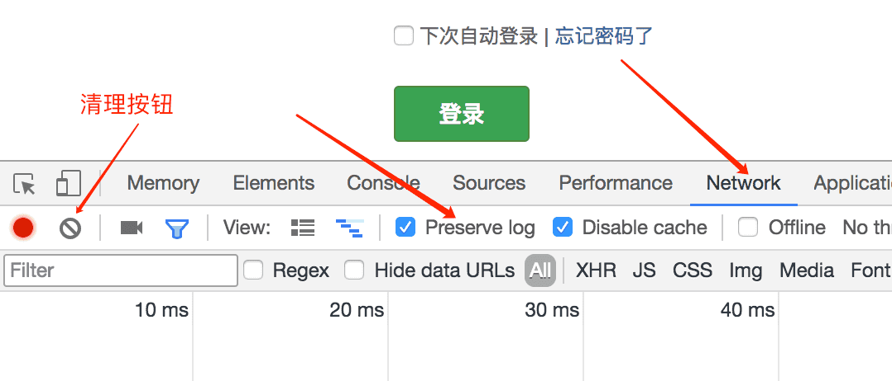
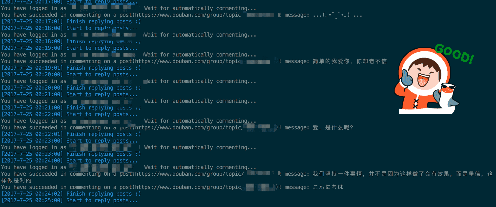

# 借助 NodeJS 写个豆瓣顶帖机器人

## 前言

以前玩豆瓣的时候总能看到有机器人在自动顶帖，觉得很好玩，也想写一个，不过当时既不会 Python 也不会 NodeJS，所以便不了了之了。最近又心血来潮，便尝试着借助 NodeJS 写了个玩玩。

## 准备

为了创造这个机器人，我们需要借助下面的库，感谢这些库的作者，他们让实现一个回帖机器人变得简单有趣。

* [cheerio](https://github.com/cheeriojs/cheerio)
* [superagent](https://github.com/visionmedia/superagent)
* [gm](https://github.com/aheckmann/gm)
* [node-tesseract](https://github.com/desmondmorris/node-tesseract)
* [node-schedule](https://github.com/node-schedule/node-schedule)

这些库都比较常见，如果你没有见过，也没关系，我会一一介绍，来吧，创造小机器人！

## 如何发起请求？

当你想写机器人的时候，你首先要搞清楚你的程序要怎样才能表现得像人一样，只有搞清楚了这个，豆瓣的服务器才不会把你拒之门外。当你用浏览器登录豆瓣并浏览小组的相关帖子时，浏览器实际上代替了你向豆瓣服务器发起了请求，请求当中包含了你的账号密码及相关信息，当你的信息通过服务器的验证后，服务器便返回了响应数据，浏览器根据响应中的  `set-cookie`字段在本地的 Cookie 中设置值，这些值中就包含了标记你为已登录状态的键值对，当你下次再向服务器发起请求时，浏览器就会将 Cookie 插入到请求中，服务器收到 Cookie 便会知道发起请求的用户是已登录状态，然后用户就可以无需多次登录而进行页面跳转和发帖操作了。而我们的小机器人所要做的，就是执行一次登录之后，保存登录之后的 Cookie，利用 Cookie 不受限制地自动顶帖。那么，如何像浏览器一样发起请求并保存 Cookie 呢？ 很遗憾，[*superagent*](https://github.com/visionmedia/superagent) 帮我们做了这件事，这是个简单易用，功能强大的 NodeJS HTTP 客户端，可以理解为这是一个受你控制的浏览器。进入豆瓣小组登录页，打开控制台可以看到提交给服务器的表单数据包含下图中的 5 项，那么我们只需要把这 5 项值填好然后让 superagent 帮我们发就好了：



```js
const agent = require('superagent');
const config = require('./config');
const loginFormData = {
            source: 'group',
            redir: 'https://www.douban.com/group/explore',
            form_email: '', // 你的账号
            form_password: '', // 你的密码
            login: '登录',
          };

agent
  .post('https://accounts.douban.com/login')
  .type('form')
  .set(config.headers) // 我在`headers`中设置了`User-Agent`，让机器人更接近浏览器
  .send(loginFormData)
  .end((err, res) => {
    console.log(res.text);
  });
```

当你发送请求后，得到的是未登录页面，为什么呢？这是因为在登录成功之后请求被重定向到另一个页面，而 superagent 并没有像浏览器一样保存之前登录得到的 Cookie，所以第二次请求时还需要设置 Cookie 或重新登录。所幸 superagent 提供了保存 Cookie 的机制，只需如下调用`.agent()`即可：

```js
const agent = require('superagent').agent();

// 同上...
```

当有其他问题时也可以借助浏览器的控制台查看手动登录时 HTTP 请求的过程来寻求答案。如下图，打开控制台，点击`Network`按钮，勾选`Preserve log`选项保存所有的 HTTP 请求，就可以观察所有发生过的请求了。



## 登录之后呢？

好的，现在登录了，再次对想评论的小组的主页面发起请求，我们获得了小组主页面的 html 文本，现在，就是 Node 端 “JQuery” - [*cheerio*](https://github.com/cheeriojs/cheerio) 登场的时候，API 虽然不及前端的丰富，但也基本满足了操作 DOM 的需求，用`const $ = cheerio.load(res.text);`加载文本后，就可以像 JQuery 一样操作 DOM 了。

```js
const cheerio = require('cheerio');
// ...

const replyPosts = function() {
  agent
    .get(config.group)
    .end(function(err, res) {
      const $ = cheerio.load(res.text);
      const loginUser = $('.nav-user-account .bn-more').text().trim(); // 用户名
      const topicObj = $('.olt tbody').children();

      console.log(`You have logged in as \`${loginUser}\`! Wait for automatically commenting...`);

      for(let i = 1; i < topicObj.length; i++) {
        const replyNumber = topicObj.eq(i).find('td').eq(2).text().trim();

        if(replyNumber < 1) {
          const topicUrl = topicObj.eq(i).find('td').eq(0).find('a').attr('href');

          accessTopicUrl(topicUrl); // 将链接传给处理链接的函数去处理
        }
      }
    });
};
```

现在，我们通过筛选得到首页所有评论数为 0 的话题的链接，并分别访问这些链接的页面以便评论。接下来再用 superagent 对主题页面的评论表单发起请求，咻咻咻，一条评论就此诞生。但是，这是不够的，我们需要的是定时的寻找新主题并自动发评论，很遗憾，[*node-schedule*](https://github.com/node-schedule/node-schedule) 帮我们做了，这是个很容易使用的定时工具，可以用来完成各种循环任务，只是简单地调用：

```js
// ...
const schedule = require('node-schedule');
// ...

schedule.scheduleJob('*/5 * * * *', () => {
      console.log('\x1b[34m%s\x1b[0m', `[${(new Date).toLocaleString()}] Start to reply posts...`); // 第一个参数只是起定义输出字符颜色的作用

      replyPosts(); // 回复帖子
    });

//...
```

## 这样，够了吗？

一般到这里，其实就够了，但是这世界上有一种东西叫验证码的东西，当你多次登录时，它就会出现，如果你不输入正确的验证码，你就无法登录，更不要想评论了。这一次我们要感谢 [Tesseract](https://github.com/tesseract-ocr/tesseract) 这个古老的用于 [OCR](https://zh.wikipedia.org/zh-hans/光学字符识别) 的项目，开始由一个实验室开发，之后被转手多次，现在由 Google 进行开发和维护，有了这个，我们就可以识别豆瓣的验证码图片了。我们首先来看一下豆瓣的验证图片，如下：


粗看以为图像不好识别，其实不然，细看发现我们所要识别的字符与周围的颜色差异较大，那么我们可以调整图片的阈值将图片转化为下面这样的黑白图片，提升图片识别的准确度：


这个任务，就交给图片处理工具，[gm](https://github.com/aheckmann/gm)，处理完后，再交给 Node 版的 Tesseract [node-tesseract](https://github.com/desmondmorris/node-tesseract)，就可以得到识别好的文本了。

```js
const tesseract = require('node-tesseract'); // 图片识别
const gm = require('gm'); // 图像处理

module.exports = {
  // 处理图片为相应的阈值的图片
  // thresholdVal 用于定义阈值 (百分比形式)
  processImg(originImgPath, targetImgPath, thresholdVal = 21) {
    return new Promise((resolve, reject) => {
      gm(originImgPath)
        .threshold(thresholdVal, '%') // 若直接使用数值会导致输出图片空白
        .write(targetImgPath, (err) => {
          if(err) return reject(err);

          resolve(targetImgPath);
        });
    });
  },

  // 识别图片
  recognizeImg(imgPath, options) {
    options = Object.assign({psm: 7}, options);

    return new Promise((resolve, reject) => {
      tesseract
        .process(imgPath, options, (err, text) => {
          if(err) return reject(err);

          resolve(text.replace(/\s/g, ''));
        });
    });
  },
};
```

值得一提的是，在安装 gm 和 node-tesseract 之前，你都必须安装他们各自的依赖，方可识别验证码。我自己的识别成功率大概在 33% 左右，如果想把成功率提高更多，可以参考 [Training Tesseract](https://github.com/tesseract-ocr/tesseract/wiki/TrainingTesseract)。

## 更好的异步写法

我最开始写用的是直接嵌套每个请求的写法，这样写起来还是太恶心，不够优雅，那么，就拿出 Promise 和 Generator 生出来的孩子 - ES8 (奈何 ES7 不要你) 中的 async/await 吧，这个其实早就有了，只是晚入标准而已，直接用顺序的思想写异步的代码，简直是 freestyle。但有一点要注意，要使用这个特性，node 版本必须不小于 7.6。现在，一切准备就绪。`node app.js`，登登登，帅！



其实还可以做更多改进，比如判断验证码后用正则检验并选择是否刷新页面再次识别验证码。另外，我发现多次评论后连评论都会出现验证码，嘿嘿嘿，这里也可以加个验证码识别功能。不断改进，就会越发智能。最后，我的机器人代码在[这里](https://github.com/yangkean/douban-robot)，如果觉得好，欢迎 Star。

## Reference

* [用node.js实现验证码简单识别](http://think2011.net/2016/01/31/node-ocr/)
