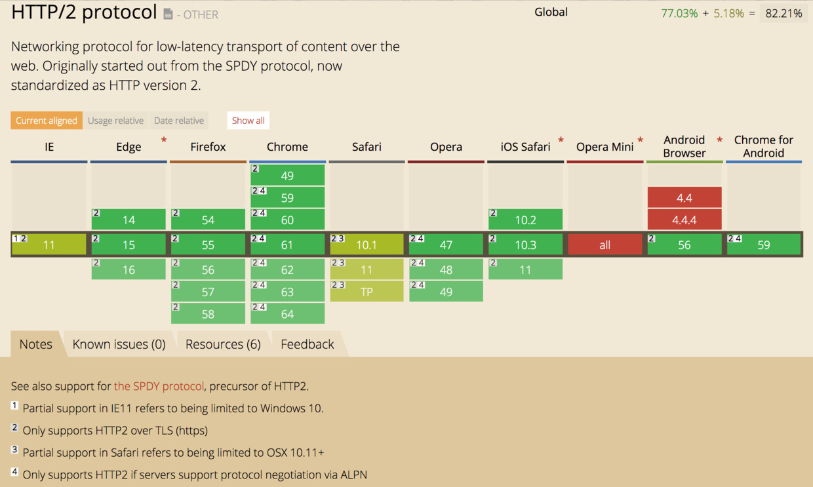

# 从 HTTP 瞎逼逼到 HTTP/2

> 我真的是在瞎逼逼，因为光是 HTTP，就足够讲一块[砖头](https://book.douban.com/subject/10746113/)了。而且，HTTP 只是协议栈的应用层的其中一个协议：），不过其他协议都不在本文讨论范围之内。如有疏漏，请指正。

## 概述：HTTP vs HTTPS vs HTTP/2 vs SSL vs TLS：这些都是啥子跟啥子？

很多缩写词被用于描述客户端与服务器端交流的过程。这些词经常被不熟悉内部原理的人混淆。

HTTP (*Hypertext Transfer Protocol*) 是客户端和服务器端都必须实现的基本交流协议。它涉及到请求 (*requests*)，响应 (*responses*)，会话 (*sessions*)，缓存 (*caching*)，认证 (* authentication*) 以及更多。在这个协议以及 HTML (*Hypertext Markup Language*) 上的工作，开始于 1989 年，由在 CERN 的 Sir Tim Berners-Lee  和他的团队主持。这个协议的第一个官方版本 (HTTP 1.0) 发布于 1996 年，随后在 1997 年发布了现在广泛使用的版本 (HTTP 1.1)。

这个协议在浏览器和服务器间传输明文 (*clear*) 信息，允许通过传输信息的网络查看传输的信息。这会产生安全的担忧，所以 **HTTP Secure** (*HTTPS*) 被引入了。HTTPS 允许客户端和服务器端先建立一个加密的通道，然后通过这个通道传输明文信息，有效地防止了信息的窃听。

加密通道是通过 **Transport Layer Security** (*TLS*) 协议创建的，这个协议以前叫 **Secure Socket Layer** (*SSL*)。这两个术语经常互换着使用。SSL 3.0 正在被 TLS 1.0 替代。SSL 是 Netscape 开发的协议，而 TLS 是一个 IETF 标准。在写这篇文章的时候，所有版本的 SSL (1.0, 2.0, 3.0) 都由于许多的安全问题而被废弃，使用它们将会在现代浏览器中产生警告，TLS 版本 (1.0, 1.1, 1.2) 正在使用中，1.3 版本现在还是草案。

所以，在大约 1996 或 1997 的某个时间，我们有了互联网的当前稳定版本 (有或者没有 SSL/TLS 的 HTTP 1.1)，这个 HTTP 版本仍然驱动着现在绝大多数网站。以前，HTTP 用于非敏感通信，比如阅读新闻，而 HTTPS 用于敏感通信，比如认证和电子商务。然而，对隐私权的关注不断增加，一些浏览器如 Google Chrome 现在会标记 HTTP 网站 为 “not private”，将在未来针对 HTTP 引入警告。

HTTP 协议的下一代升级版 —— HTTP/2，于 2015 年发布，正在被越来越多的网站所采纳。这个协议增加了新的特色，如 压缩 (*compression*)，多路复用 (*multiplexing*)，请求优先级 (*prioritization of requests*)等，用于减少等待时间、提升性能和安全性。

在 HTTP 1.1 版本，安全连接是可选的，你可以使用 HTTP 或 HTTPS，但在 HTTP/2，安全连接几乎是强制的，即使标准定义了有 TLS 的 HTTP/2 和没有 TLS 的 HTTP/2，但大部分浏览器提供商已经声明它们将只支持拥有 TLS 的 HTTP/2。

## HTTP

### HTTP 的基本性质

#### 简单

HTTP 的消息被设计为简单可读。这一点只要你打开浏览器控制台看看请求和响应头就知道了。

#### 可扩展

除了规范规定的那些 header，我们会看到很多非官方规定的 header，这些扩展的 header 可以用来实现新的功能。

#### 无状态

这意味着即使你对服务器发起过一次请求，当你再发起一次请求时，服务器也不知道你拜访过它，基本的 HTTP 请求中是不含状态信息的。所幸我们可以增加 cookie 的头部扩展来记录状态信息。

#### 使用可靠连接
 
HTTP 依赖于运输层的 TCP 协议进行消息传递，而 TCP 是可靠的。

### 状态码

状态码的第一个数字代表当前响应类型

* 1xx - 信息，请求已被服务器接收，继续处理
* 2xx - 成功，请求已成功被服务器接收、理解、并接受
* 3xx - 重定向，需要后续操作才能完成这一请求
* 4xx - 客户端错误，请求含有词法错误或者无法被执行
* 5xx - 服务器端错误，服务器在处理某个正确请求时发生错误

### HTTP 的请求方法

#### 较少用的方法

* OPTIONS：请求服务器告知其支持的各种功能。可以询问服务器通常支持哪些方法，或者对某些特殊资源支持哪些方法
* HEAD：向服务器发出指定资源的请求，但服务器在响应中只返回首部，不会返回实体的主体即资源的 body 部分
* PUT：向服务器写入资源
* DELETE：请服务器删除请求 URL 所指定的资源
* TRACE：HTTP 请求在传输的过程中是可能会被修改的。这个方法允许客户端在最终将请求发送给服务器时，看看它变成了什么样子。主要用于测试或诊断
* CONNECT：这个方法将请求的连接转换为透明的 TCP/IP 隧道，通常用于加快基于 SSL 加密的通信
* PATCH：这个方法请求对资源进行局部修改

#### 常用方法

##### GET && POST

GET 是最常用的方法，用于请求服务器发送某个资源。POST 方法用于向服务器发送数据，注意这和 PUT 的写入资源是不同的，写入的资源是存储在服务器的，而发送的数据会发送到其他地方去处理，这可能会导致新资源的创建或已存在资源的更新，POST 通常用于支持 HTML 表单。

##### 这两个方法有什么区别？

> **幂等**
> 在数学中，幂等有两种主要含义：
> * 在某二元运算下，**幂等元素**是指被自己重复运算的结果等于它自己的元素。例如 0 * 0 仍然为 0，所以 0 在乘法下是幂等的。
> * 某一元运算为**幂等**的时，其作用在任一元素两次后会和其作用一次的结果相同，例如 恒等函数 `f(x) = x` 就是幂等的。
>
> 在计算机网络中，假如在不考虑诸如错误或者过期等问题的情况下，若干次请求的副作用与单次请求相同或者根本没有副作用，那么这些请求方法就能够被视作是“幂等”的。

我们知道，GET 用于表单数据提交时，表单数据会被编码在请求的 URI 上，这样极不安全，因为请求的地址可能在情趣到达目的地之前被打印，然后被第三方看到。而 POST 提交的数据是放在请求体中的，比 GET 提交数据安全，当然，没有 HTTPS，POST 提交的数据也能被看到。

但是最主要的区别，应该为如下三点：

* **安全性**(*safe*): GET 请求是安全的，这里的安全是指 GET 方法只获取信息而不做其他操作。而 POST 请求则是不安全的，因为它会更新或创建资源。

* **幂等性**(*idempotent*): GET 请求是幂等的，幂等就是上面所说的若干次请求的副作用与单次请求相同，而 POST 请求则是不幂等的。

* **可缓存性**(*cacheable*): GET 请求的响应是可缓存的，POST 请求的响应一般是不可缓存的，除非设置了合适的 Cache-Control 或 Expires 头部字段。

## HTTPS

### 为什么优先要使用 HTTPS？

有三个主要原因：

* 机密性 (*Confidentiality*)

这能保护通信的双方在公共媒介中免遭信息窃听。如果没有 HTTPS，当你通过 WiFi 接入点网上购物时，WiFi 接入点的运营者就能看到你的信用卡之类的隐私信息。

* 数据完整性 (*Integrity*)

这能保证信息能不受改变地完整到达目的地。比如，WiFi 可以在我们的网站上增加广告，降低图片质量或者改变文章的内容。HTTPS 能确保网站不被更改。

* 身份验证 (*Authentication*)

这能保证网站不会是假冒的，域名是哪个，站点就是哪个。比如，一些运行 WiFi 接入点的猥琐之人可以把浏览器导向一些假冒的网站。HTTPS 能确保`example.com`就是真的`example.com`，有些安全证书甚至要检查网站的合法身份，让你知道`yourbank.com`是`YourBank, Inc`，即 YourBank 公司。

### 使用 HTTP 头部字段保护你的 web 应用

#### 禁用秘密信息的缓存

浏览器默认缓存 HTTP 的 GET 请求的响应，如果使用的是共享个人电脑 (网吧不就是么？)，那么猥琐之人就能通过访问浏览器的缓存得到他人的隐私信息。所以我们要在返回隐私信息时使用三个响应头字段来禁用客户端的缓存：

* `Cache-Control: no-cache, no-store, max-age=0, must-revalidate`
**cache-control** 字段用来指定在这次的请求/响应链中的所有缓存机制都必须遵守的指令。上面的三个指令告诉客户端和代理在使用缓存前必须送请求到服务器进行验证，不要储存响应，在请求发生之后的 0 秒后缓存即过期，在使用缓存的响应前检查其状态并禁止使用过期的响应。

* `Pragma: no-cache`
这个字段用于向后兼容 HTTP 1.0，确保老客户端能不缓存响应。

* `Expires: -1`
这个字段用于指定响应过期的时间戳。指定为`-1`的话，客户端就会立即把响应当做过期的，这就避免了缓存。

请在需要保护隐私时才禁用缓存，否则你的应用加载速度将大打折扣。

#### 强制 HTTPS

HTTPS 的重要性我在前面已经说了，要强制 HTTPS，我们要使用 **HTTP Strict Transport Security** (HSTS) 头部字段，具体可以设置为`Strict-Transport-Security: max-age=31536000; includeSubDomains; preload`。

`max-age`是指示浏览器为当前域名缓存这个头部字段指定秒数，这里是缓存一年。`includeSubDomains`指示浏览器将 HSTS 应用于当前域名的所有子域名。`preload`强制浏览器总是安全地加载你的 web 应用，甚至在你第一次访问网站且未收到响应前，这个特性是通过将一个安全预加载的域名的列表硬编码到浏览器代码中实现的，要使用这个特性你需要在 [HSTS Preload List Submission](https://hstspreload.org/) 注册你的域名，当然啦，使用这个指令你得确保你的应用能只使用 HTTPS。

#### 允许 XSS 过滤

XSS 即跨站脚本攻击，是很普遍也很简单的网络攻击手法。我们会使用`X-XSS-Protection: 1; mode=block`，**X-XSS-Protection**这个字段指示浏览器是否为当前页面开启浏览器内建的 XSS 过滤机制并覆盖浏览器本身的相关设置。`1`表示允许过滤器，反之为`0`，`mode=block`指示浏览器在检测到 XSS 攻击后禁止加载整个页面。

#### 控制 Framing

一个 iframe 是一个可以允许在一个父 web 应用中嵌套一个 web 应用的 DOM 元素。这个元素可以让点击劫持 (* clickjacking*) 更容易。点击劫持可以欺骗用户点击非用户本意的东西。为了阻止这种攻击，我们使用`X-Frame-Options: SAMEORIGIN`，**X-Frame-Options**这个字段指示浏览器是否允许你的 web 应用嵌套在另一个 web 应用中，SAMEORIGIN 表示你的应用可以在同域名页面的 frame 中展示。注意当在 Content-Security-Policy 字段中指定了 frame-ancestors 时，则 X-Frame-Options 被忽略，见 [这里](https://www.w3.org/TR/CSP11/#frame-ancestors-and-frame-options)。

#### 明确白名单

CSP (*Content Security Policy*) 定义了一个非常强大的基于浏览器的安全机制，允许对你的 web 应用中的资源加载和脚本执行加以控制。有了它，你可以将允许脚本加载、ajax 调用、图片和样式表加载的域列入白名单，可以允许或禁止内联脚本和动态脚本等。我们可以通过简单设置`Content-Security-Policy: script-src 'self'`来允许同源的脚本加载以及阻止动态脚本和内联脚本执行。**Content-Security-Policy** 是个比较复杂的头部字段，详细的配置可以在[这里](https://www.html5rocks.com/en/tutorials/security/content-security-policy/)看到。

#### 阻止 Content-Type 嗅探

为了使用户体验更连贯，很多浏览器实现了一个叫 “Content-Type 嗅探” 或 “MIME 嗅探” 的功能，这个功能使浏览器能通过实际资源的比特位检测 HTTP 中响应资源的类型而不理会响应头中的`Content-Type`字段声明的资源类型。但这会导致 MIME 混淆攻击 (*MIME confusion attack*)。于是乎，我们要使用`X-Content-Type-Options: nosniff`，指示浏览器在处理获取的资源时不要使用嗅探。

## HTTP/2

多数主流浏览器已经在2015年底支持了该协议。此外，根据 W3Techs 的数据，在2017年5月，在排名前一千万的网站中，有13.7% 支持了HTTP/2。这真真是极吼滴！有图有真相。

### HTTP/2 相比 HTTP 1.x 的主要区别

#### 是二进制的而非文本的

有别于 HTTP/1.1 中的明文请求，HTTP/2 将一个 TCP 连接分为若干个流 (*stream*)，每个流中可以传输若干消息 (*message*)，每个消息由若干最小的二进制帧 (*frame*) 组成。这样更利于高效地解析，而且不容易出错，毕竟 HTTP/1.x 的 header 中有空白行、大小写、换行、空行之类的规定。

#### 是完全多路复用而非按顺序和阻塞的

HTTP/1.x 有一个 **head-of-line blocking** 的问题，它会让一个连接一次只能发送一个请求。多路复用允许多个请求和响应消息同时发出，甚至可以混合一个消息的一部分和另一个消息。

#### 只开一个连接用于并发的请求

HTTP/1.x 中为了加载资源会同时打开多个 TCP 连接，每个连接在响应时又都会发送大量数据，存在中间网络 (*intervening network*) 缓冲区溢出的危险，导致网络阻塞和重发 (* retransmits*)。而且，使用那么多的 TCP 连接也是一种大量占用网络资源的行为。

#### 压缩头部

在大型网站中，一个页面往往要请求大量资源并得到相应，算上那些往返的话，那么头部就会占据相当大的开销，所以压缩头部的好处便变得显而易见了。

#### 允许服务器主动推送资源给客户端

在 HTTP/1.x 中，当浏览器请求了一个页面，服务器发送了 HTML 页面的响应，然后服务器需要等待浏览器解析了 HTML 文件后再发起嵌入在 HTML 页面中的多个资源的请求，想想都觉得慢。而服务器端推送避免了这种往返的延迟，服务器会主动推送它认为的客户端会需要缓存的资源。要小心的是，这个功能滥用的话，会损害性能。

### 如何拥抱 HTTP/2？

HTTP/2 是向后兼容 HTTP/1.1 的，所以完全不需要担心现有的网站会发生什么问题。然而，很多对于 HTTP/1.1 来说是最佳实践的技巧却会在使用 HTTP/2 时降低性能。再者，从 HTTP/1.1 转向 HTTP/2 势必是漫长的，因为服务器端升级容易，但只要一日绝大多数人仍然使用着老旧甚至是史前浏览器，客户端就会是扎心窝的痛。我们需要做些过渡时期的事。

#### 转向 TLS

第一要务是让你的网站运行在安全连接上，因为厂商大佬们已经说过了：我们哥们几个只支持有 TLS 的 HTTP/2，那些不支持 TLS 的可以歇菜了。所以国内大片的 HTTP 网站们要好好考虑转向 HTTPS 的事了。

#### 雪碧图不再总是最佳的选择

在 HTTP/1.1 中，对于浏览器来说，获取一个巨大的图片文件比请求多个小图片文件高效，这是因为多个请求会互相排队，增加加载时间。通常的做法是把多个小图片转成一个雪碧图。

转成一个雪碧图就只需要一个 HTTP 请求了。但是咧，如果一个页面中只使用到雪碧图中的一个图标，仍然下载整个雪碧图就显得不是很好了。HTTP/2 拥有多路复用的能力，所以多个请求排队的事已经不存在了，很多时候单个地请求图片将是更好的选择。当然，需要使用所有图标时，雪碧图仍然是需要的。

#### 使用 Data URI 内嵌图片是一种阻碍

在 HTTP/1.1 中，为了减少 HTTP 请求，你可以把图片直接以 Data URI 的形式嵌入 CSS 或 HTML 文件中。因为转成的字符编码会很长，自然增加了 CSS 或 HTML 文件的大小。在 HTTP/2 中，HTTP 请求变得廉价，这种 “最佳实践” 便变成了一种妨碍。

#### 合并 CSS 文件和 JavaScript 文件未必好

我们在应用的构建阶段，通常会合并那些小的 CSS 和 JavaScript 文件，本意是减少 HTTP 请求。但是在 HTTP/2 中，HTTP 请求是廉价的，合并便不再显得有优势。可能更糟糕的是，如果你因为合并引入了很多非本页面所需的文件，反而拖慢了加载速度，当然，你是可以通过 webpack 来配置相应页面所需的相应文件的，可是别忘了，合并文件是要引入大量处理合并的代码的，在 HTTP/2 廉价的请求中，这些多余的处理代码看来有点多余，止增笑耳。

#### 域名分片可能会坑你

在 HTTP/1.1 中，每个域名能打开的连接是受到限制的，大概为 6 - 8 个，具体取决于浏览器实现。如果你实在要加载大量资源，其中一个方法就是从多个域名中获取资源，这就是域名分片 (*domain sharding*)。这个方法能实现更好的加载时间，也有能导致[问题](https://calendar.perfplanet.com/2013/reducing-domain-sharding/)，当然，准备这种服务就会有额外的开支。HTTP/2 则移除了域名分片的需求，在 HTTP/2 下，浏览器只为每个域名打开一个连接，但是人家有多路复用嘛，并发请求的数量根本不受限制 (当然也可以通过 [SETTINGS_MAX_CONCURRENT_STREAMS](https://tools.ietf.org/html/rfc7540#section-6.5.2) 来限制)。而且，域名分片在 HTTP/2 中还会损害性能，因为它创建了额外的 TCP 连接，妨碍 HTTP/2 为资源进行优先级排序。

当前对于 HTTP/1.1 的最佳实践是限制域名分片为 2 个域名。好消息是为了减少工作并在 HTTP/1.1 和 HTTP/2 都能达到很好的效果，有方法可以让 HTTP/2 合并你的连接，具体方法见 Google 家的 [slide 26](https://docs.google.com/presentation/d/1r7QXGYOLCh4fcUq0jDdDwKJWNqWK1o4xMtYpKZCJYjM/present#slide=id.g40fbe7d8c_076)。

## 实现

可喜的是，现在已经有大量的 HTTP/2 的服务器端实现了，涵盖了多种语言，参见
 [Implementations](https://github.com/http2/http2-spec/wiki/Implementations)。

## Reference

* [The Complete Guide To Switching From HTTP To HTTPS](https://www.smashingmagazine.com/2017/06/guide-switching-http-https/)
* [An overview of HTTP](https://developer.mozilla.org/en-US/docs/Web/HTTP/Overview)
* [Hypertext Transfer Protocol](https://en.wikipedia.org/wiki/Hypertext_Transfer_Protocol)
* [Method Definitions](http://www.w3.org/Protocols/rfc2616/rfc2616-sec9.html#sec9) 
* [HTTP协议中GET和POST方法的区别](https://sunshinevvv.coding.me/blog/2017/02/09/HttpGETv.s.POST/)
* [How To Secure Your Web App With HTTP Headers](https://www.smashingmagazine.com/2017/04/secure-web-app-http-headers/)
* [List of HTTP header fields - Wikipedia](https://en.wikipedia.org/wiki/List_of_HTTP_header_fields)
* [RFC 7540 - Hypertext Transfer Protocol Version 2 (HTTP/2)](https://tools.ietf.org/html/rfc7540)
* [HTTP/2 - Wikipedia](https://en.wikipedia.org/wiki/HTTP/2)
* [Getting Ready For HTTP2: A Guide For Web Designers And Developers](https://www.smashingmagazine.com/2016/02/getting-ready-for-http2/)
* [HTTP/2 Frequently Asked Questions](https://http2.github.io/faq/)
